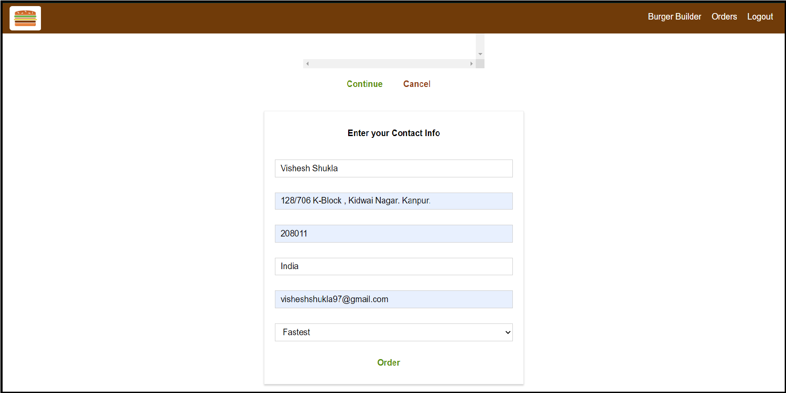

**The Burger Builder**

**React Based Project where Users can order Burgers with by selecting ingredients.**

**Users can also SignUp and Login to Make New Orders and View thier Previous Orders.**

**Website Automatically Switches to Mobile View when Viewed On Mobile Devices.**

**Packages Used - Redux, Redux-Thunk, React-Router, Axios. Firebase for Database and Authentication.**

**Check It Out At-**  https://burger-builder-56fa5.web.app/   **(live production build)**

**Mobiles View-**

  

**Desktop View*-*

 

 

 

