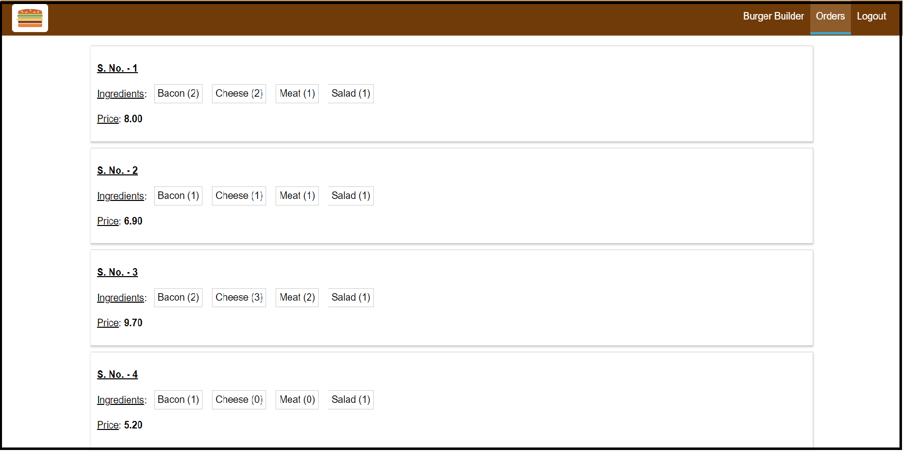

# The Burger Builder Website

**React Based Website where Users can order Burgers with by selecting ingredients.**

**Users can SignUp and Login to Make New Orders and View thier Previous Orders.**

**Website Automatically Switches to Mobile View when Viewed On Mobile Devices.**

**<ins>Packages Used</ins> - Redux, Redux-Thunk, React-Router, Axios. Firebase for Database and Authentication.**

**<ins>Check It Out At</ins> -**  https://burger-builder-56fa5.web.app/   **(live production build @Firebase Static Hosting.)**

**<ins>Mobile View</ins> -**

  

**<ins>Desktop View</ins> -**

 

 

 

